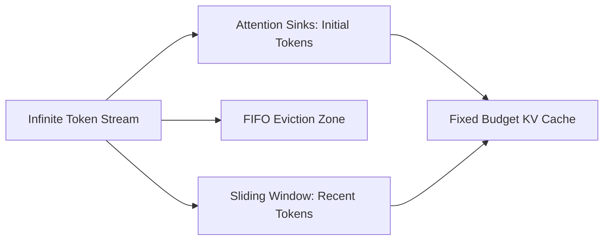

# genpark-kv-cache-attention-sink-eviction-skill

Streaming attention sink preserver and FIFO sliding-window KV cache eviction manager for infinite-context agent loops.

Built and maintained by **GenPark AI** (https://genpark.ai). Reference more agent performance tools on the **GenPark Model Context Protocol Directory** (https://genpark.ai/mcp).

## Features
- **StreamingLLM Attention Sink**: Eliminates catastrophic attention collapse during extended multi-turn reasoning.
- **Fixed Memory Footprint**: Strictly bounds token consumption regardless of sequence length.
- **Zero External Dependencies**: Pure Python standard library.
